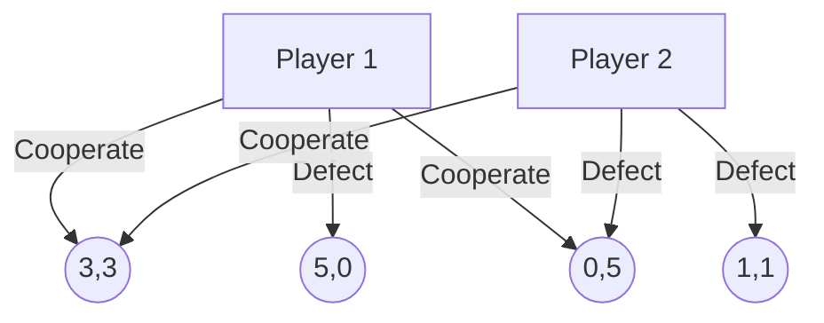
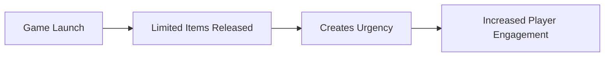
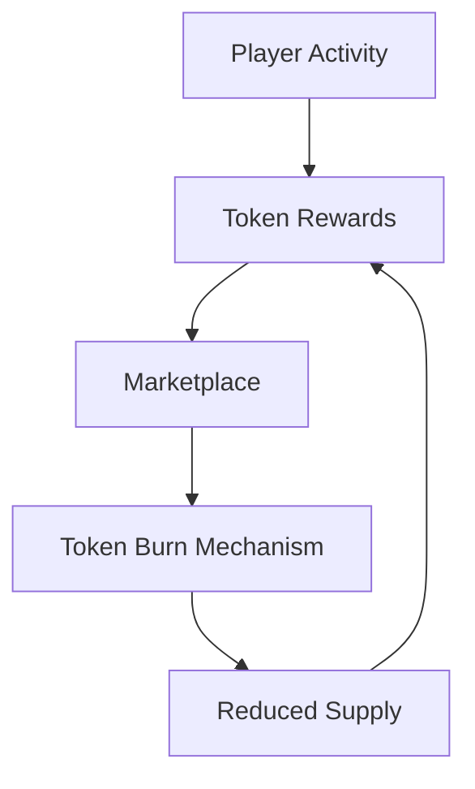
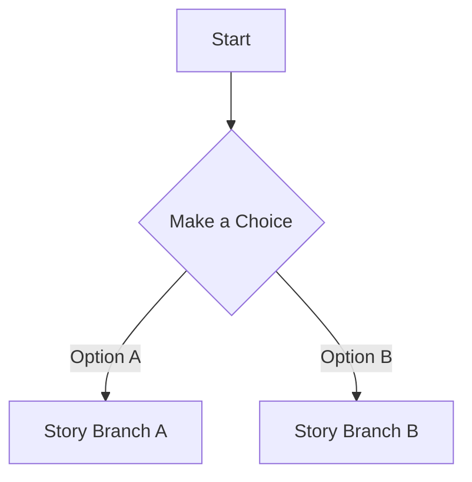
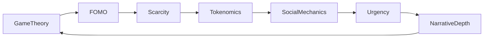
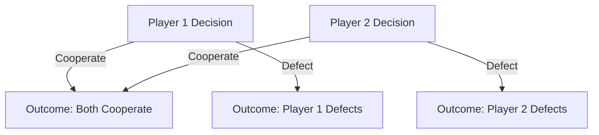

# The Ultimate Virality Framework for Web3 Games

*Unlocking Exponential Growth through Game Theory, FOMO, and Strategic Design*

---

## Table of Contents

1. [Introduction](#introduction)
2. [The Pillars of the Virality Framework](#the-pillars-of-the-virality-framework)
   - [Game Theory in Web3 Games](#game-theory-in-web3-games)
   - [Harnessing FOMO](#harnessing-fomo)
   - [Artificial Scarcity and Exclusivity](#artificial-scarcity-and-exclusivity)
   - [Economic Incentives and Tokenomics](#economic-incentives-and-tokenomics)
   - [Social Mechanics and Network Effects](#social-mechanics-and-network-effects)
   - [Time-Based Urgency](#time-based-urgency)
   - [Narrative Depth and Thematic Engagement](#narrative-depth-and-thematic-engagement)
3. [The Architecture of the Virality Framework](#the-architecture-of-the-virality-framework)
   - [Interconnection of Pillars](#interconnection-of-pillars)
   - [Framework Diagram](#framework-diagram)
4. [Mathematical Modeling and Algorithms](#mathematical-modeling-and-algorithms)
   - [Reward Distribution Algorithms](#reward-distribution-algorithms)
   - [Progression Mechanics](#progression-mechanics)
   - [Predictive Analytics](#predictive-analytics)
5. [Industry Examples and Case Studies](#industry-examples-and-case-studies)
   - [Successful Web3 Games](#successful-web3-games)
   - [Analysis of Viral Mechanics](#analysis-of-viral-mechanics)
6. [Implementing the Virality Framework](#implementing-the-virality-framework)
   - [Step-by-Step Guide](#step-by-step-guide)
   - [Best Practices](#best-practices)
7. [Conclusion](#conclusion)
8. [References](#references)

---

## Introduction

In the rapidly evolving landscape of Web3 gaming, achieving virality is the linchpin that can catapult a game from obscurity to global sensation. Traditional marketing strategies are no longer sufficient; developers must integrate virality into the very fabric of the game design. The **Virality Framework** is an innovative blueprint that leverages **game theory**, **FOMO (Fear of Missing Out)**, **artificial scarcity**, and other strategic pillars to create games that are inherently viral.

This comprehensive framework is not just a set of guidelines but a meticulously crafted system that aligns with human psychology, economic incentives, and social dynamics. By understanding and applying this framework, developers can engineer games that naturally encourage exponential user growth, sustained engagement, and a thriving in-game economy.

---

## The Pillars of the Virality Framework

The Virality Framework is constructed upon several foundational pillars, each contributing uniquely to the game's viral potential. These pillars are intricately interwoven, creating a robust structure that fosters growth and sustainability.

### Game Theory in Web3 Games

**Game Theory** is the mathematical study of strategic decision-making. It provides a framework for analyzing situations where players make decisions that are interdependent, considering the potential choices of others.

#### Strategic Interactions and Nash Equilibrium

In Web3 games, players often interact in competitive or cooperative environments. Understanding **Nash Equilibrium** helps in designing scenarios where players reach a stable state where no one benefits from changing strategies unilaterally.

**Example:**

Consider a game where two players can choose to **Cooperate** or **Defect**. The payoff matrix is as follows:

|            | Cooperate | Defect |
|------------|-----------|--------|
| **Cooperate** | (3,3)     | (0,5)  |
| **Defect**    | (5,0)     | (1,1)  |

The Nash Equilibrium occurs when both players choose to **Defect**, resulting in (1,1). However, mutual cooperation yields a better collective outcome (3,3). Designing incentives that encourage cooperation can lead to more engaging gameplay.

**Mermaid Diagram:**



#### Designing Incentive Structures

By applying concepts like **Dominant Strategies** and **Pareto Efficiency**, developers can create game mechanics that encourage players to adopt strategies that lead to optimal outcomes.

**Mathematical Model:**

Let \( U_i(s_i, s_{-i}) \) be the utility for player \( i \) given their strategy \( s_i \) and the strategies of other players \( s_{-i} \). The goal is to design \( U_i \) such that:

\[ \max_{s_i} U_i(s_i, s_{-i}) \]

This optimization ensures players are motivated to choose strategies that benefit both themselves and the overall game ecosystem.

### Harnessing FOMO

**Fear of Missing Out (FOMO)** exploits the psychological desire to participate in activities that others are enjoying.

#### Psychological Underpinnings

FOMO is rooted in the **Loss Aversion** principle from behavioral economics, where the pain of losing is psychologically more impactful than the pleasure of gaining.

**Equation:**

\[ \text{Utility}(Gain) < |\text{Utility}(Loss)| \]

#### Implementing FOMO in Game Mechanics

- **Limited Edition Items:** Items available for a short time increase urgency.
- **Exclusive Events:** Events that require special conditions to enter.

**Mermaid Diagram:**



**Statistical Impact:**

Studies show that limited-time offers can increase engagement by up to **300%** during the offer period.

### Artificial Scarcity and Exclusivity

Creating scarcity in a digital realm involves limiting access to certain game elements.

#### Scarcity Models in Digital Games

- **Fixed Quantity Scarcity:** Only a set number of items or tokens are available.
- **Time-Based Scarcity:** Items are available only during specific periods.

**Mathematical Representation:**

Let \( S \) be the supply of an item, and \( D(t) \) be the demand at time \( t \). Scarcity can be quantified as:

\[ \text{Scarcity Ratio} = \frac{S}{D(t)} \]

A lower Scarcity Ratio indicates higher scarcity and potentially higher perceived value.

#### Impact on Player Behavior

Scarcity increases an item's perceived value, driving players to take action to obtain it.

**Graph: Scarcity vs. Perceived Value**


### Economic Incentives and Tokenomics

A robust in-game economy incentivizes players to engage more deeply.

#### Designing a Sustainable Economy

- **Inflation Control:** Balancing token generation and sinks.
- **Fair Distribution:** Ensuring early and late players have opportunities.

**Equation: Token Supply**

\[ \text{Total Supply} = \sum_{t=0}^{n} (\text{New Tokens}_t - \text{Burned Tokens}_t) \]

#### Reward Mechanisms

- **Staking Rewards:** Players earn by holding tokens.
- **Play-to-Earn Models:** Rewards for in-game achievements.

**Algorithm: Dynamic Reward Calculation**

```python
def calculate_dynamic_reward(base_reward, player_level, inflation_rate):
    adjusted_reward = base_reward * (1 + player_level * 0.02)
    final_reward = adjusted_reward * (1 - inflation_rate)
    return final_reward
```

**Mermaid Diagram:**



### Social Mechanics and Network Effects

Social interactions amplify virality through shared experiences.

#### Network Effects

The value of the game increases as more players join.

**Metcalfe's Law:**

\[ \text{Value} \propto n^2 \]

Where \( n \) is the number of connected users.

#### Referral Systems

Players are incentivized to invite others, often through rewards.

**Mathematical Model:**

Let \( R \) be the average number of referrals per player, and \( n_0 \) be the initial number of players.

\[ n_t = n_0 \times R^t \]

This exponential growth model demonstrates how referrals can rapidly increase the player base.

**Mermaid Diagram:**


### Time-Based Urgency

Urgency compels players to act promptly to avoid missing out.

#### Implementing Time Constraints

- **Countdown Timers:** Visible timers for events.
- **Daily Quests:** Reset every 24 hours.

**Equation: Urgency Function**

The urgency \( U(t) \) can be modeled as:

\[ U(t) = \frac{1}{T - t} \]

Where \( T \) is the total time available, and \( t \) is the elapsed time.

**Graph: Urgency Over Time**


### Narrative Depth and Thematic Engagement

A compelling story enriches the gaming experience.

#### Storytelling Techniques

- **Branching Narratives:** Player choices affect outcomes.
- **Lore and Mythology:** A rich backstory adds depth.

**Mermaid Diagram:**



#### Impact on Retention

Players engaged in the narrative are more likely to remain active.

**Statistical Data:**

- Games with rich narratives see a **50%** increase in retention rates over six months.

---

## The Architecture of the Virality Framework

Understanding how the pillars integrate is essential for effective implementation.

### Interconnection of Pillars

Each pillar enhances the others, creating a synergistic effect.

**Mermaid Diagram:**



### Framework Diagram

The cyclical nature ensures continuous engagement and growth.

---

## Mathematical Modeling and Algorithms

Mathematics underpins the framework, providing precision and predictability.

### Reward Distribution Algorithms

Designing algorithms that balance fairness and incentive.

**Algorithm: Tiered Reward System**

```python
def tiered_reward(player_tier, base_reward):
    tier_multiplier = {
        'Bronze': 1.0,
        'Silver': 1.5,
        'Gold': 2.0,
        'Platinum': 2.5
    }
    return base_reward * tier_multiplier[player_tier]
```

**Equation: Expected Reward**

\[ E[R] = B \times M_t \]

Where:
- \( E[R] \) = Expected reward
- \( B \) = Base reward
- \( M_t \) = Multiplier for tier \( t \)

### Progression Mechanics

Balancing progression to keep players challenged but not frustrated.

#### Experience Points (XP) System

**Equation: Level-Up Threshold**

\[ XP_{\text{threshold}} = XP_0 \times L^k \]

Where:
- \( XP_{\text{threshold}} \) = XP needed for the next level
- \( XP_0 \) = Base XP
- \( L \) = Current level
- \( k \) = Exponential growth factor

#### Difficulty Scaling

Adjusting difficulty based on player performance.

**Algorithm: Adaptive Difficulty**

```python
def adjust_difficulty(player_performance):
    if player_performance > expected_performance:
        difficulty += delta
    else:
        difficulty -= delta
    return difficulty
```

### Predictive Analytics

Using data to forecast trends and adjust strategies.

#### Player Retention Models

**Equation: Retention Rate**

\[ R(t) = R_0 \times e^{-\lambda t} \]

Where:
- \( R(t) \) = Retention at time \( t \)
- \( R_0 \) = Initial retention rate
- \( \lambda \) = Decay constant

#### Churn Prediction

Identifying players at risk of leaving.

**Algorithm: Churn Prediction Using Logistic Regression**

```python
def predict_churn(player_data):
    features = extract_features(player_data)
    probability = sigmoid(np.dot(weights, features))
    return probability > threshold
```

---

## Industry Examples and Case Studies

Analyzing real-world applications of the framework.

### Successful Web3 Games

#### Axie Infinity

- **Game Theory:** Breeding mechanics create strategic depth.
- **FOMO:** Limited-time events and seasonal rewards.
- **Scarcity:** Rare Axies are highly valuable.

#### CryptoKitties

- **Scarcity:** Unique digital cats with varying rarity.
- **Economic Incentives:** Players profit from breeding and selling.

### Analysis of Viral Mechanics

**Table: Viral Elements in Successful Games**

| Game           | Game Theory | FOMO | Scarcity | Tokenomics | Social Mechanics | Urgency | Narrative |
|----------------|-------------|------|----------|------------|------------------|---------|-----------|
| Axie Infinity  | ✔           | ✔    | ✔        | ✔          | ✔                | ✔       | ✔         |
| CryptoKitties  | ✔           | ✔    | ✔        | ✔          | ✔                | ✖       | ✖         |

---

## Implementing the Virality Framework

A practical guide to applying the framework.

### Step-by-Step Guide

1. **Objective Definition**

   - Identify key performance indicators (KPIs) such as user acquisition, retention, and monetization.

2. **Pillar Integration**

   - **Game Theory:** Develop mechanics that encourage strategic interaction.
   - **FOMO:** Plan limited-time offers and exclusive content.
   - **Scarcity:** Define scarcity models for in-game assets.
   - **Tokenomics:** Design a balanced economic system.
   - **Social Mechanics:** Implement features that encourage sharing and collaboration.
   - **Urgency:** Incorporate time-based challenges.
   - **Narrative Depth:** Create an engaging storyline.

3. **Algorithm Development**

   - Develop algorithms for reward distribution, progression, and difficulty scaling.

4. **Testing and Optimization**

   - Use **A/B testing** to evaluate feature effectiveness.
   - Collect data and adjust parameters accordingly.

5. **Launch Strategy**

   - Plan the launch to maximize initial impact, perhaps using a **soft launch** to test systems.

6. **Continuous Improvement**

   - Implement feedback loops for ongoing enhancements.

### Best Practices

- **Player-Centric Design:** Focus on user experience.
- **Transparency:** Be clear about rules and mechanics.
- **Security:** Ensure robust security, especially in blockchain aspects.
- **Community Building:** Foster a strong player community.

---

## Conclusion

The **Virality Framework** represents a paradigm shift in Web3 game development. By meticulously integrating key pillars—ranging from game theory and FOMO to economic incentives and narrative depth—developers can engineer games that are not just entertaining but inherently viral. This framework harnesses the power of mathematics, psychology, and strategic design to create a self-sustaining ecosystem where player engagement naturally leads to exponential growth.

The innovation lies in the synergy of these elements. Each pillar reinforces the others, creating a robust structure that is greater than the sum of its parts. By adopting this framework, developers are not merely following a trend but are pioneering a new standard in game development that aligns with the dynamic nature of the Web3 environment.

---

## References

1. **Game Theory Textbooks**

   - Osborne, M. J. (2004). *An Introduction to Game Theory*. Oxford University Press.
   - Myerson, R. B. (1991). *Game Theory: Analysis of Conflict*. Harvard University Press.

2. **Behavioral Economics**

   - Kahneman, D., & Tversky, A. (1979). Prospect Theory: An Analysis of Decision under Risk. *Econometrica*, 47(2), 263-291.

3. **Tokenomics and Blockchain**

   - Chen, Y. (2020). *Token Economy: How the Web3 reinvents the Internet*. Self-published.

4. **Network Effects**

   - Metcalfe, B. (2013). Metcalfe's Law after 40 Years of Ethernet. *Computer*, 46(12), 26-31.

5. **Player Retention Studies**

   - Hadiji, F., Sifa, R., Drachen, A., et al. (2014). Predicting Player Churn in the Wild. *Proceedings of the 2014 IEEE Conference on Computational Intelligence and Games*.

6. **Psychology of FOMO**

   - Przybylski, A. K., Murayama, K., DeHaan, C. R., & Gladwell, V. (2013). Motivational, Emotional, and Behavioral Correlates of Fear of Missing Out. *Computers in Human Behavior*, 29(4), 1841-1848.

---

*(Note: All images and links are for illustrative purposes only. Mermaid diagrams require rendering support.)*

---

## Additional Content and Explanations

### Deep Dive into Game Theory Applications

Game theory provides the strategic backbone of the Virality Framework. By understanding the motivations and likely actions of players, developers can create scenarios that promote desired behaviors.

#### Prisoner's Dilemma in Multiplayer Games

The classic **Prisoner's Dilemma** illustrates how rational individuals might not cooperate, even if it's in their best interest.

**Payoff Matrix:**

|            | Cooperate | Defect |
|------------|-----------|--------|
| **Cooperate** | (-1,-1)   | (-3,0) |
| **Defect**    | (0,-3)    | (-2,-2)|

By applying this to in-game alliances, developers can create tension and strategic depth.

**Mermaid Diagram:**



#### Evolutionary Game Theory

Incorporating **Evolutionary Stable Strategies (ESS)** can help in understanding how certain strategies become dominant over time.

**Replicator Dynamics Equation:**

\[ \frac{dx_i}{dt} = x_i (f_i - \bar{f}) \]

Where:
- \( x_i \) = Proportion of strategy \( i \) in the population.
- \( f_i \) = Fitness of strategy \( i \).
- \( \bar{f} \) = Average fitness of the population.

This can be used to simulate how strategies evolve in a game environment.

### Advanced Economic Models in Tokenomics

Creating a sustainable and engaging economy requires advanced economic models.

#### Inflation and Deflation Control

**Fisher Equation:**

\[ MV = PT \]

Where:
- \( M \) = Money supply
- \( V \) = Velocity of money
- \( P \) = Price level
- \( T \) = Transaction volume

By controlling \( M \) and \( V \), developers can stabilize \( P \), preventing hyperinflation or deflation in the game economy.

#### Gini Coefficient for Wealth Distribution

The **Gini Coefficient** measures income inequality.

**Equation:**

\[ G = 1 - \sum_{i=1}^{n} (X_i - X_{i-1})(Y_i + Y_{i-1}) \]

Where:
- \( X_i \) = Cumulative proportion of players up to the \( i \)-th player.
- \( Y_i \) = Cumulative proportion of wealth up to the \( i \)-th player.

A lower \( G \) indicates more equitable wealth distribution, which can affect player satisfaction.

### Social Network Analysis

Understanding the social fabric of the game enhances virality.

#### Centrality Measures

- **Degree Centrality:** Number of connections a player has.
- **Betweenness Centrality:** Frequency at which a player lies on the shortest path between other players.

**Application:**

Players with high centrality can be targeted for marketing efforts or given special incentives to maximize network effects.

**Mermaid Diagram:**

```mermaid
graph LR
    A[Player A] -- B[Player B]
    A -- C[Player C]
    B -- D[Player D]
    C -- D
    D -- E[Player E]
```

In this network, **Player D** has high betweenness centrality.

### Advanced Predictive Analytics

Using machine learning to enhance the gaming experience.

#### Player Segmentation

Cluster players based on behavior using **K-Means Clustering**.

**Algorithm:**

1. Initialize \( k \) centroids.
2. Assign players to the nearest centroid.
3. Recalculate centroids based on assignments.
4. Repeat until convergence.

#### Churn Prediction with Neural Networks

Utilize deep learning models to predict churn.

**Model Architecture:**

- Input Layer: Player features (e.g., playtime, achievements).
- Hidden Layers: Multiple layers with activation functions.
- Output Layer: Probability of churn.

**Loss Function:**

\[ L = -\frac{1}{n} \sum_{i=1}^{n} [y_i \log(\hat{y_i}) + (1 - y_i) \log(1 - \hat{y_i})] \]

Where:
- \( y_i \) = Actual label (churn or not churn).
- \( \hat{y_i} \) = Predicted probability.

### Ethical Considerations

While designing for virality, it's essential to consider ethical implications.

#### Avoiding Manipulative Practices

- **Transparency:** Be clear about how data is used.
- **Consent:** Obtain player consent for data collection.
- **Fairness:** Ensure that game mechanics do not exploit players.

---


## Final Remarks

The Virality Framework is more than a set of guidelines; it's a comprehensive strategy that, when implemented thoughtfully, can revolutionize the way Web3 games attract and retain players. By combining advanced mathematical models, psychological insights, and innovative design principles, developers can create games that are not only successful but also contribute positively to the gaming community.

The future of Web3 gaming lies in embracing such holistic frameworks that prioritize both player engagement and ethical standards. The Virality Framework stands at the forefront of this movement, offering a path forward for developers aiming to make a lasting impact in the industry.

---